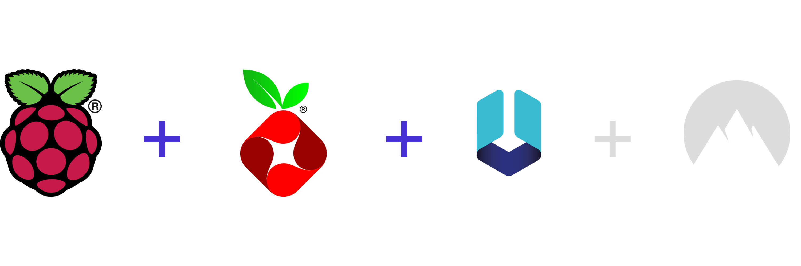

<div id="top"></div>

<div align="center">

| DONATE                                                                                                                                                                         | CORE                                                                                                                 | LANGAUGES                                                                                                                               |
| ------------------------------------------------------------------------------------------------------------------------------------------------------------------------------ | -------------------------------------------------------------------------------------------------------------------- | --------------------------------------------------------------------------------------------------------------------------------------- |
| [](https://www.buymeacoffee.com/carlowisse) |  |                                   |
| [](https://paypal.me/cjwisse?country.x=AU&locale.x=en_AU)                 |    |  |

</div>

<br>

<!-- PROJECT LOGO -->
<div align="center">
  <a href="https://github.com/carlowisse/sentinel">
    
  </a>

  <h1 style="text-align: center; font-weight: 600; letter-spacing: 2px; border-bottom: none;">SENTINEL</h1>

  <p style="text-align: center; font-size: 18px;">
    A network wide ad and adware denier, malware and spyware denier, crypto miner denier, tracker and analytics denier and a recursive, caching DNS resolver all in one!
    <br />
    <a href="#easy">Easy Install</a> &#183;
    <a href="https://github.com/carlowisse/sentinel-lists">Sentinel Lists</a>
  </p>
</div>

<br>

## Summary
* Installs and Configures Pi-Hole
* Installs and Configures Unbound DNS
* Configures Static IP
* _**8,263,054 Domains**_
* _**1,186 Regexes**_
* Allows Platforms by Choice (Social)
* Increases Pi-Hole Speed With IPTables
* Massive Collection of Curated Domain and Regex Lists

<a href="#top"></a>

<br>

## About The Project
<div align="center">
  <a href="https://github.com/carlowisse/sentinel">
    
  </a>
</div>

Security is a very important factor when accessing the internet and unforunately it is not something that is built into systems by default. This is done on purpose so that your privacy is stripped away and your data can be sold.

Sentinel is the answer to these problems. Encrypting your data, denying all ads, trackers, crypto miners (browser), malware, adware, spyware and more on the network (no need to set it up on every device) and implements a validating, recursive, caching DNS resolver that runs locally so that YOU are in control.

Here is why Sentinel would be good for you:
* Deny ads, not just in your browser but also on TV streaming apps and other devices that don't allow plugins
* Deny trackers
* Deny telemetry
* Deny constant analytics
* Deny common doxxing URIs
* Deny typo squatting domains
* Deny browser based crypto miners
* Deny malware
* Deny agency snooping (CIA, FBI, NSA, etc.)
* Deny constant social network callouts
* Deny autodiscover leaks
* Deny AMP sites
* Protect yourself against malware, adware and spyware
* Speed up network using a caching DNS resolver

<a href="#top"></a>

<br>

## Built With
**Software**
* [Pi-Hole](https://github.com/pi-hole)
* [Unbound](https://github.com/NLnetLabs/unbound)
* [Sentinel Lists](https://github.com/carlowisse/sentinel-lists)
* [Raspberry Pi OS](https://www.raspberrypi.com/software/)

**Hardware**
* [Raspberry Pi 4 Model B 8GB](https://www.raspberrypi.com/products/raspberry-pi-4-model-b/)
* [15W USB-C Power Supply](https://www.raspberrypi.com/products/type-c-power-supply/)
* [Micro HDMI to Standard HDMI Cable](https://www.raspberrypi.com/products/micro-hdmi-to-standard-hdmi-a-cable/)
* [Flirc Raspberry Pi 4 Case](https://flirc.tv/products/flirc-raspberrypi4-silver)
* [CAT8 Ethernet Cable](https://www.amazon.com/s?k=cat+8+cable&i=electronics&ref=nb_sb_noss)
* [32GB SanDisk Extreme Pro Micro SD Card](https://www.westerndigital.com/en-au/products/memory-cards/sandisk-extreme-pro-uhs-ii-sd#SDSDXDK-032G-GN4IN)

**Optional**
* Mouse
* Keyboard

<a href="#top"></a>

<br>

## Getting Started
All instruction sets require the cloning or downloading of this repository as there are helper scripts used in each instruction set.

<br>

## Requirements
### Install Git & Clone Repo On Raspeberry Pi
> You must clone Sentinel in the root directory
```
sudo apt install git

cd

git clone https://github.com/carlowisse/sentinel.git
```

<span id="easy">

<br>

## The Easy Way
> _This installation uses a single script to set up **Static IP**, **Pi-Hole**, **Unbound**, **IPTables** and **Sentinel**_

1. Make executable: `chmod +x ./sys-prep.sh`
2. Make executable: `chmod +x ./init.sh`
3. Prepare system: `sudo ./sys-prep.sh`
4. Run installer: `sudo ./init.sh`

<br>

## Manual Installation
> _If you do not wish to set up your security router as a Sentinel install, feel free to only follow the instruction sets that you would like. They are decoupled and do not rely on eachother._

* [Pi-Hole Setup With 8.2 Million+ Domains Denied (and allow-list options)](documentation/Sentinel.md)
* [Validating, Recursive, Caching DNS Resolver](documentation/SentinelUnbound.md)

<a href="#top"></a>

<br>

## Contributing
Contributions are what make the open source community such an amazing place to learn, inspire, and create. Any contributions you make are **greatly appreciated**.

If you have a suggestion that would make this better, please fork the repo and create a pull request. You can also simply open an issue with the tag `enhancement`.

1. Fork the Project
2. Create your Feature Branch (`git checkout -b feature/amazing-feature`)
3. Commit your Changes (`git commit -m 'Added an amazing feature'`)
4. Push to the Branch (`git push origin feature/amazing-feature`)
5. Open a Pull Request

<a href="#top"></a>

<br>

## Issues
If there are any issues during install, or manual configuration (steps missed/needed), please raise an issue on the issue tab and I will look into it.

If there is an issue with the lists please go to the [sentinel-lists](https://github.com/carlowisse/sentinel-lists) repository and raise an issue there.

<br>

## License
Distributed under the MIT License. See [LICENSE](LICENSE.txt) for more information.

<br>

## Contact
Carlo Wisse - [Twitter](https://twitter.com/carlowisse) - [Email](mailto:contact@carlowisse.com)

<br>

## Acknowledgments
* [Choose an Open Source License](https://choosealicense.com)

<a href="#top"></a>
