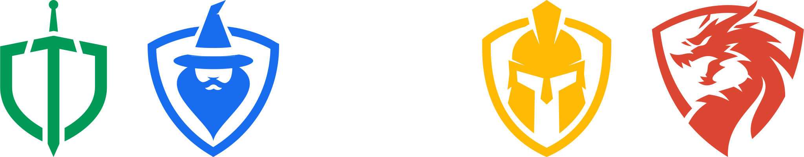

<div id="top"></div>

<div align="center">

|                                                                                               DONATE                                                                                               |                                                               CORE                                                               |                                                            LANGUAGES                                                             |
| :------------------------------------------------------------------------------------------------------------------------------------------------------------------------------------------------: | :------------------------------------------------------------------------------------------------------------------------------: | :------------------------------------------------------------------------------------------------------------------------------: |
| <a href="https://www.buymeacoffee.com/carlowisse"></a> |  |              |
|      <a href="https://paypal.me/cjwisse?country.x=AU&locale.x=en_AU"></a>      |              |  |
|                                                                                                                                                                                                    |                    |      |
|                                                                                                                                                                                                    |            |                    |
|                                                                                                                                                                                                    |              |                |
|                                                                                                                                                                                                    |                    |                  |
</div>

<br>

<!-- PROJECT LOGO -->
<div align="center">
  

  <h1 style="text-align: center; font-weight: 600; letter-spacing: 2px; border-bottom: none;">SENTINEL</h1>

  <p style="text-align: center; font-size: 18px;">
    A network wide ad, adware, malware, spyware, tracker, analytics and crypto miner denier with a recursive, caching DNS resolver, DHCP Service and Alerting system and a Virtual Private Network all-in-one!
    <br />
    <a href="https://github.com/carlowisse/sentinel-lists">sentinelLists</a>&nbsp; &#183; &nbsp;
    <a href="https://github.com/carlowisse/sentinel-unbound">sentinelUnbound</a>&nbsp; &#183; &nbsp;
    <a href="https://github.com/carlowisse/sentinel">sentinelCore</a>&nbsp; &#183; &nbsp;
    <a href="https://github.com/carlowisse/sentinel-alert">sentinelAlert</a>&nbsp; &#183; &nbsp;
    <a href="https://github.com/carlowisse/sentinel-guard">sentinelGuard</a>
  </p>

  <br>

  
</div>

<br>

## Modules
* `sentinelLists` - A supermassive collection of curated **domain (12,717,020)**, **regex (1,177)** and **adblock (1,138,465)** lists
* `sentinelUnbound` - A custom Unbound configuration
* `sentinelCore` - A custom PI-Hole configuration
* `sentinelAlert` - A custom DHCP Managment and Alerting system
* `sentinelGuard` - A custom VPN (WireGuard) configuration with Web UI for easy management

## Summary
* Installs and Configures Pi-Hole
* Installs and Configures Unbound DNS
* Installs and Configures WireGuard VPN
* Installs and Configures PiAlert
* Loads Sentinel Lists
* Configures Static IP
* Configures Firewall
* **Web UI for Pi-Hole, Unbound, WireGuard and PiAlert**

<a href="#top"></a>

<br>

## About The Project
Security is a very important factor when accessing the internet and unforunately it is not something that is built into systems by default. This is done on purpose so that your privacy is stripped away and your data can be sold.

Sentinel is the answer to these problems. Encrypting your data, denying all ads, trackers, crypto miners (browser), malware, adware, spyware and much more on a network level (no need to set it up on every device) and implements a validating, recursive, caching DNS resolver that runs locally so that YOU are in control.

Alongside this, Sentinel also comes with a built in DHCP server that has a management and alerting system so that you can see what devices are on your network and if any new devices join, you will be notified.

Finally, Sentinel also comes with a fully configured VPN (WireGuard) that you can use to access your network from anywhere in the world. This is great for when you are out and about and would like to leverage the security of your **sentinelEnabled** home network.

**Here is why Sentinel would be good for you**
* Deny ads, not just in your browser but also on TV streaming apps and other devices that don't allow plugins
* Deny trackers
* Deny telemetry
* Deny constant analytics
* Deny common doxxing URIs
* Deny typo squatting domains
* Deny browser based crypto miners
* Deny malware
* Deny agency snooping (CIA, FBI, NSA, etc.)
* Deny adult sites
* Deny constant social network callouts
* Deny autodiscover leaks
* Deny AMP sites
* Protect yourself against malware, adware and spyware (AKA: badware)
* Speed up network using a caching DNS resolver
* Get remote access into your network using a VPN
* Control and monitor your network using a DHCP management and alerting system

<a href="#top"></a>

<br>

## Built With
**Software**
* [Pi-Hole](https://github.com/pi-hole)
* [Pi.Alert](https://github.com/leiweibau/Pi.Alert)
* [Unbound](https://github.com/NLnetLabs/unbound)
* [WireGuard Tools](https://github.com/WireGuard/wireguard-tools)

**Hardware**
* [Raspberry Pi 4 Model B 8GB](https://www.raspberrypi.com/products/raspberry-pi-4-model-b/)
* [15W USB-C Power Supply](https://www.raspberrypi.com/products/type-c-power-supply/)
* [Micro HDMI to Standard HDMI Cable](https://www.raspberrypi.com/products/micro-hdmi-to-standard-hdmi-a-cable/)
* [Flirc Raspberry Pi 4 Case](https://flirc.tv/products/flirc-raspberrypi4-silver)
* [CAT8 Ethernet Cable](https://www.amazon.com/s?k=cat+8+cable&i=electronics&ref=nb_sb_noss)
* [32GB SanDisk Extreme Pro Micro SD Card](https://www.westerndigital.com/en-au/products/memory-cards/sandisk-extreme-pro-uhs-ii-sd#SDSDXDK-032G-GN4IN)

**Optional**
* Mouse
* Keyboard

<a href="#top"></a>

<br>

## Requirements
### Install Git & Clone Repo On To Raspeberry Pi
> You must clone Sentinel in the root directory
```
sudo apt install git

cd

git clone https://github.com/carlowisse/sentinel.git
```

<br>

## Installation
> _This installation uses a single script to set up **Static IP**, **Pi-Hole**, **Unbound**, **IPTables** and **Sentinel**_

1. Make executable: `chmod +x ./sys-prep.sh`
2. Make executable: `chmod +x ./init.sh`
3. Prepare system: `sudo ./sys-prep.sh`
4. Run installer: `sudo ./init.sh`

<br>

## Contributing
Contributions are what make the open source community such an amazing place to learn, inspire, and create. Any contributions you make are **greatly appreciated**.

If you have a suggestion that would make this better, please fork the repo and create a pull request. You can also simply open an issue with the tag `enhancement`.

1. Fork the Project
2. Create your Feature Branch (`git checkout -b feature/amazing-feature`)
3. Commit your Changes (`git commit -m 'Added an amazing feature'`)
4. Push to the Branch (`git push origin feature/amazing-feature`)
5. Open a Pull Request

<a href="#top"></a>

<br>

## Issues
If there are any issues please raise an issue on the issue tab and I will look into it.

If there is an issue with the lists please go to the [sentinel-lists](https://github.com/carlowisse/sentinel-lists) repository and raise an issue there.

## License
Distributed under the MIT License. See [LICENSE](LICENSE.txt) for more information.

<br>

## Contact
Carlo Wisse - [Twitter](https://twitter.com/carlowisse) - [Email](mailto:contact@carlowisse.com)

<br>

## Acknowledgments
* [Choose an Open Source License](https://choosealicense.com)
* [leiweibau](https://github.com/leiweibau)

<a href="#top"></a>
