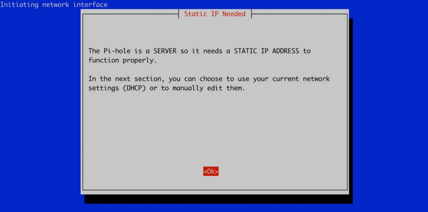
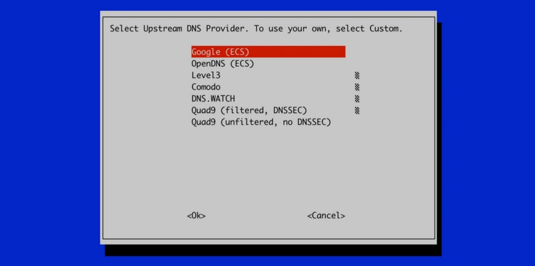
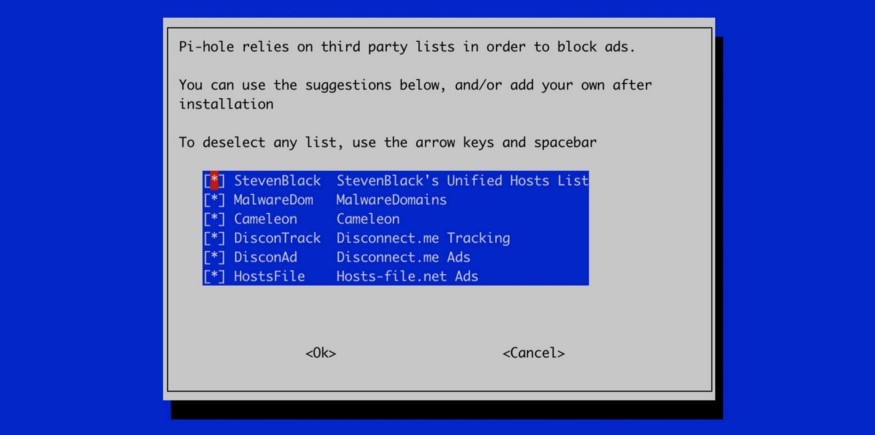
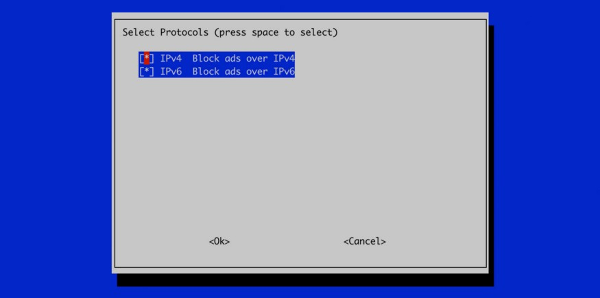
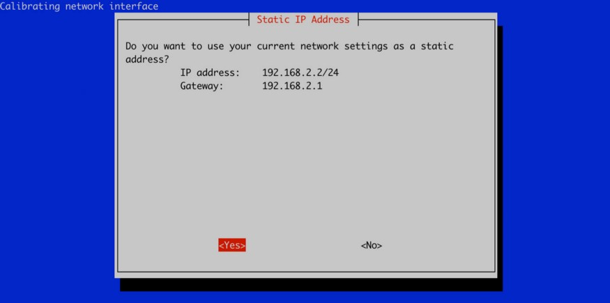
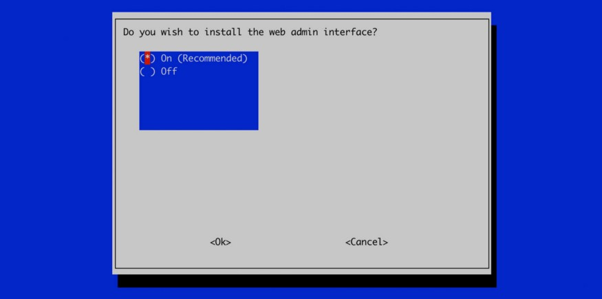
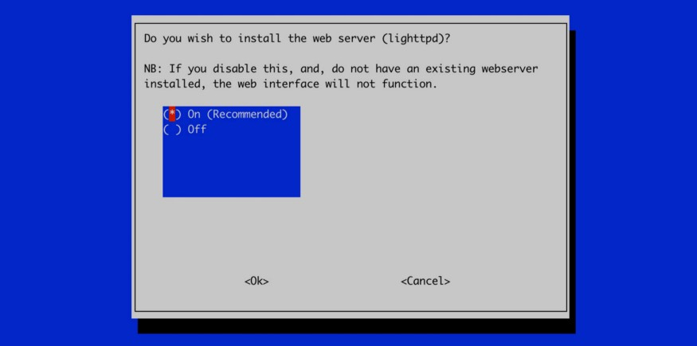
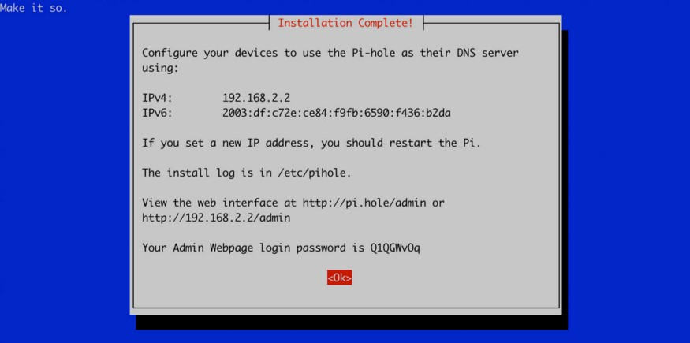
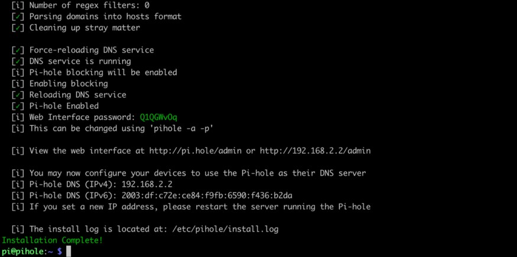

# SentinelCore
> Pi-Hole setup that denies 3.6 million+ domains.

## Login To Raspberry Pi
* **Username:** pi
* **Password:** raspberry

## Update and Upgrade
```
sudo apt update && sudo apt upgrade -y && sudo apt dist-upgrade -y && sudo apt autoremove -y
```

## Set Up Raspberry Pi

### Get Python 3 And SQLite3
```
sudo apt install python3 sqlite3
```

### Set Hostname
```
sudo raspi-config
```

1. Network Options
2. Hostname
3. Change Entry To `sentinel`
4. Go Back To Home
5. Interfacing Options
6. SSH
7. Yes
8. Location
9. Timezone
10. WLAN Country

> You can now SSH into your Raspberry Pi from another computer.

### Set A Static IP Address
1. Get Current (Static) IP
    ```
    hostname -I
    ```
2. Get Router IP
    ```
    ip route show | grep -i 'default via'| awk '{print $3 }')
    ```
3. `sudo nano /etc/dhcpcd.conf`
    1. Change first line to `sentinel`
    2. Scroll to the end of the file and set the following for the `eth0` interface
        ```
        interface eth0
        static ip_address=[STAIC_IP]/24
        static routers=[ROUTER_IP]
        static domain_name_servers=[ROUTER_IP]
        ```

## Install Pi-Hole
```
curl -sSL https://install.pi-hole.net | bash
```

## Static IP Already Set
1. Press `Ok`

    

## Set DNS
1. Select Your Choice (I recommend `Cloudflare`)
2. Press `Ok`

    

## Select Deny Lists
> By default they are all selected, leave it like this.
1. Press `Ok`

    

## Select IP Protocol Version
> We want to deny ads and trackers on all protocols. By default both will be selected.
1. Press `Ok`

    

## Confirm IP Address And Gateway
> IP Address is of yout Raspberry Pi. Gateway is your Router IP Address.
1. Confirm details
2. Press `Yes`

    

## Install Web Admin Interface
1. Select `On (Recommended)`
2. Press `Ok`

    

## Install Web Server
1. Select `On (Recommended)`
2. Press `Ok`

    

## Configure Logging
1. Select `On (Recommended)`
2. Press `Ok`

    

3. Select `0 Show everything`
4. Press `Ok`

    

## Save Summary
> You will be presented with a summary including a PASSWORD that you will NEED TO KEEP.
1. Take a snapshot or record the details somewhere
2. MAKE SURE YOU SAVE THE PASSWORD SOMEWHERE (or use `pihole -a p` to set a different one)
3. Press `Ok`

    

## Finished Install



### Sentinel Deny List
1. Navigate to `sentinel/scripts/`
2. Run `bash deny-lists.sh`

## Sentinel Allow List
> I recommend using `common.txt` and `url_shorteners.txt`.
1. Navigate to `sentinel/scripts/`
2. Run `bash allow-lists.sh`

## Social Platforms
> I have split social platforms up so you can choose to enable the ones you would like.

1. Navigate to `sentinel/scripts`
2. Use the `apply-allow-list.sh` or `apply-allow-regex-list.sh` script
3. Supply the raw URL link after the script like below:

```
cd sentinel/scripts

chmod +x ./apply-allow-list.sh

./apply-allow-list.sh https://media.githubusercontent.com/media/carlowisse/sentinel-lists/main/lists/domains/allow/social/messenger.txt
```

**OR FOR REGEX**

```
cd sentinel/scripts

chmod +x ./apply-allow-regex-list.sh

./apply-allow-regex-list.sh https://media.githubusercontent.com/media/carlowisse/sentinel-lists/main/lists/regex/allow/social/messenger.txt
```

> You can use **ANY** raw URL from around the internet.

### Update Gravity
```
pihole -g
```

## Setup IPTables
1. Navigate to `sentinel/scripts`
2. Run `bash configure-iptables`

## REBOOT
```
sudo reboot
```